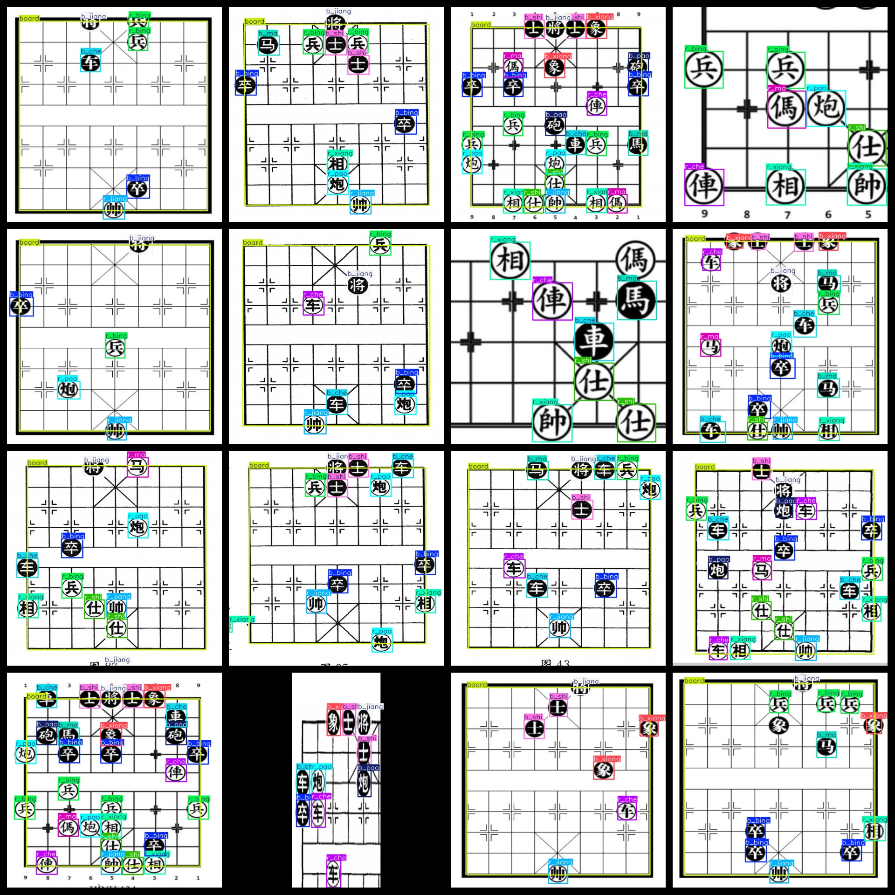
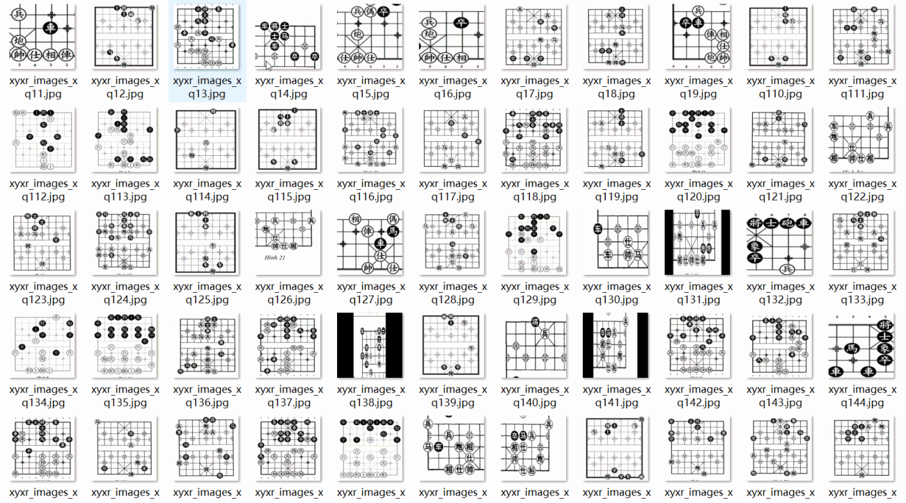

# [Object Detection] Elephant Go Detection Dataset 940 imagesYOLO+VOC format

Dataset Format: VOC format + YOLO format

The compressed file contains: three folders, each storing images, xml files, and text files.

Total jpg images in JPEGImages folder: 940

The total number of XML files in the Annotations folder is 940.

The total number of txt files in the labels folder is 940.

Number of tag types: 15

Tag names: ["b_bing","b_che","b_jiang","b_ma","b_pao","b_shi","b_xiang","board","r_bing","r_che","r_jiang","r_ma","r_pao","r_shi","r_xiang"]

The number of boxes for each label (Note that the order of labels in the Yolo format does not correspond to this, but is based on the classes.txt file in the labels folder):

b_bing frame count = 1538

b_che frame count = 889

b_jiang frame count = 791

b_ma frame count = 694

b_pao frame count = 656

b_shi frame count = 1216

b_xiang frame count = 906

board frame count = 631

r_bing frame count = 1510

r_che frame count = 759

r_jiang frame count = 809

r_ma frame count = 711

r_pao frame count = 849

r_shi frame count = 855

r_xiang frame count = 816

Total boxes: 13630

Picture clarity (Resolution: Pixels): Clear

Is the image enhanced: No

Shape of the label: Rectangular box, used for object detection and recognition.

Important Note: None

Special Notice: This dataset does not guarantee the accuracy or precision of the trained models or weight files. The dataset only provides accurate and reasonable annotations.

Annotations

Picture overview

## Images

---

Here is a pay link on Stripe (https://buy.stripe.com/3cs8yP7sY87d0vu9AB). Please contact me lonlonago@foxmail.com after funding $89, and I will send you a complete data files, thank you!

